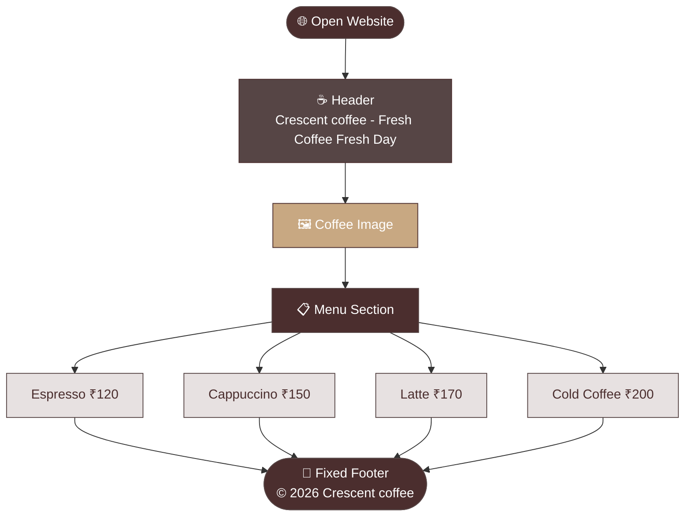

# ☕ CRESCENT COFFEE 

> *Fresh Coffee, Fresh Day* — A cozy coffee shop webpage built with HTML & CSS.


---

## ✨ Features

- ☕ Warm cozy coffee themed design
- 🖼️ Background coffee image
- 📋 Menu section with 4 items and prices
- 📌 Fixed footer at bottom

---

## 📁 Folder Structure
```
📁 coffee-bliss/
   ├── 📄 index.html
   ├── 🎨 style.css
   └── 🖼️ coffe inspo.jpg
```

---

## 🔄 Page Flow


---

## 🍵 Menu

| Item | Price |
|------|-------|
| Espresso | ₹120 |
| Cappuccino | ₹150 |
| Latte | ₹170 |
| Cold Coffee | ₹200 |

---

## ▶️ How to Run
```bash
1. Download all files
2. Keep index.html, style.css and image in same folder
3. Open index.html in browser
4. Enjoy! ☕
```

---

> *Built with HTML & CSS only* 💪  
> © 2026 Cresecent coffee| Made by swanandi
